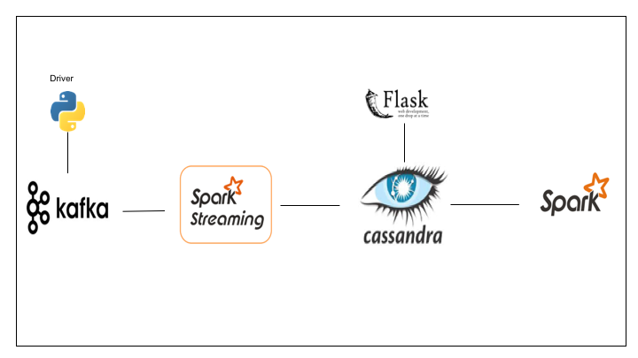
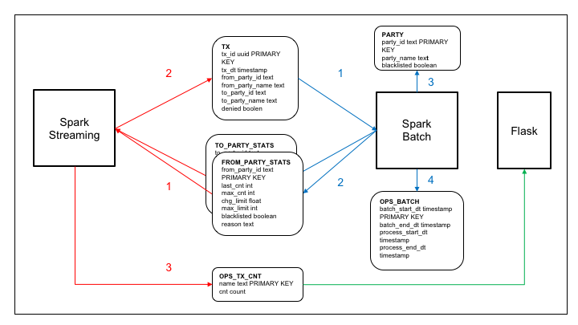

# SafePay
SafePay - fast and safe P2P payment
Insight Data Engineering project

[Presentation](https://docs.google.com/presentation/d/1_lU_j1KYGDEHNnhl2ZPPzT0R1si3TQVir_rS-OTf50U)

## Motivation

Objectives of exploring P2P transactions

## Stack

Justify technology choices

## Architecture

Decoupled Fast and Safe

Explain data flow

## Results

DB/disk is the bottleneck

Coordinating Streaming and Batch processing. Requires memory and parallel processing.

